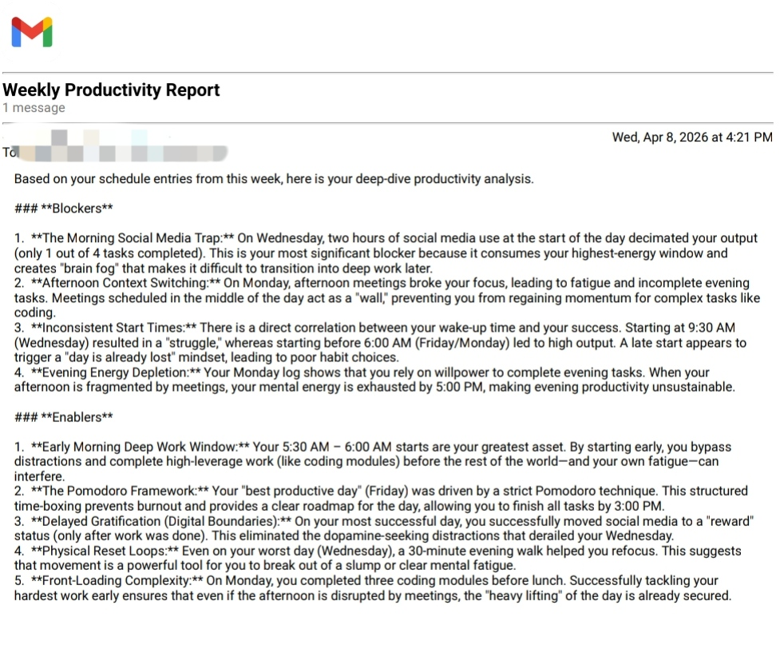

# ChronoMind 🧠

A personal journaling REST API built with Spring Boot — featuring JWT authentication, categorized journal entries, and AI-powered weekly productivity reports delivered via email.

---

## Features

- **JWT Authentication** — Stateless, token-based security for all protected endpoints
- **Journal Entries** — Create, read, update, and delete personal journal entries
- **Entry Categorization** — Two types: `PRODUCTIVITY` (tracked in reports) and `CASUAL` (private journaling)
- **AI-Powered Weekly Reports** — Every Sunday, Gemini AI analyzes your productivity entries and emails you a structured report with Blockers and Enablers
- **Role-Based Access Control** — `ROLE_USER` and `ROLE_ADMIN` roles with protected admin endpoints
- **Swagger UI** — Interactive API documentation available out of the box

---

## Tech Stack

| Layer | Technology |
|---|---|
| Language | Java 11 |
| Framework | Spring Boot 2.7.16 |
| Database | MongoDB Atlas |
| Security | Spring Security + JWT (JJWT 0.12.5) |
| AI | Google Gemini 2.5 Flash |
| Email | Spring Mail (Gmail SMTP) |
| Documentation | SpringDoc OpenAPI (Swagger UI) |
| Build Tool | Maven |

---

## Project Structure

```
src/main/java/com/danish/chronoMind/
├── config/
│   ├── GeminiConfig.java        # Gemini AI client and system prompt
│   ├── OpenApiConfig.java       # Swagger UI configuration
│   └── SpringSecurity.java      # Security filter chain and JWT setup
├── controller/
│   ├── AdminController.java     # Admin-only endpoints
│   ├── JournalEntryController.java
│   ├── PublicController.java    # Auth endpoints (signup, login)
│   └── UserController.java
├── dto/                         # Request/Response DTOs and Mapper
├── entity/
│   ├── JournalEntry.java
│   └── User.java
├── enums/
│   └── JournalType.java         # PRODUCTIVITY | CASUAL
├── filter/
│   └── JwtFilter.java           # JWT validation on every request
├── repository/
│   ├── UserRepository.java
│   ├── UserRepositoryImpl.java  # MongoTemplate custom queries
│   └── JournalEntryRepository.java
├── scheduler/
│   └── UserScheduler.java       # Weekly email job (every Sunday 9AM)
├── services/
│   ├── EmailService.java
│   ├── JournalEntryService.java
│   ├── UserDetailServiceImpl.java
│   └── UserService.java
└── utils/
    └── JwtUtil.java             # Token generation and validation
```

---

## API Endpoints

### Public — No authentication required

| Method | Endpoint | Description |
|---|---|---|
| GET | `/public` | Health check |
| POST | `/public/signup` | Register a new user |
| POST | `/public/login` | Login and get JWT token |

### User — JWT required

| Method | Endpoint | Description |
|---|---|---|
| PUT | `/user` | Update profile (username, password, email, weeklyReport) |
| DELETE | `/user/delete` | Delete account and all journal entries |

### Journal — JWT required

| Method | Endpoint | Description |
|---|---|---|
| GET | `/journal` | Get all journal entries of logged-in user |
| GET | `/journal/id/{id}` | Get a specific journal entry by ID |
| POST | `/journal` | Create a new journal entry |
| PUT | `/journal/id/{id}` | Update a journal entry |
| DELETE | `/journal/delete/{id}` | Delete a journal entry |

### Admin — `ROLE_ADMIN` required

| Method | Endpoint | Description |
|---|---|---|
| GET | `/admin/all-user` | Get all registered users |
| POST | `/admin/create-admin` | Create a new admin user |

---

## Getting Started

### Prerequisites

- Java 11+
- Maven 3.6+
- MongoDB Atlas account
- Gmail account with App Password enabled
- Google Gemini API key (`GOOGLE_API_KEY` set in environment)

### Environment Variables

Set the following environment variables before running:

| Variable | Description |
|---|---|
| `MONGODB_URI` | MongoDB Atlas connection string |
| `MAIL_USERNAME` | Gmail address used for sending reports |
| `MAIL_PASSWORD` | Gmail App Password (not your account password) |
| `JWT_SECRET` | Secret key for JWT signing — minimum 32 characters |
| `APP_BASE_URL` | Base URL of the deployed app (e.g. `https://your-domain.com/chronoMind`) |
| `APP_ENV` | Environment label shown in Swagger UI (e.g. `Production`) |
| `GOOGLE_API_KEY` | Google Gemini API key for AI report generation |

### Run Locally

```bash
# Clone the repository
git clone https://github.com/your-username/chronoMind.git
cd chronoMind

# Set environment variables (or create a .env file and export them)
export MONGODB_URI=your_mongodb_uri
export MAIL_USERNAME=your_email@gmail.com
export MAIL_PASSWORD=your_app_password
export JWT_SECRET=your-secret-key-minimum-32-characters
export GOOGLE_API_KEY=your_gemini_api_key

# Build and run
mvn spring-boot:run
```

App will start at: `http://localhost:8080/chronoMind`

Swagger UI: `http://localhost:8080/chronoMind/docs`

---

## Authentication Flow

```
POST /public/signup  →  Create account
POST /public/login   →  Receive JWT token
                        ↓
Add to every request: Authorization: Bearer <token>
```

JWT tokens are valid for **24 hours**. After expiry, login again to get a new token.

---

## Weekly Productivity Report

Users who have:
- A valid email address set on their profile
- `weeklyReport` set to `true`

...will automatically receive an AI-generated email every **Sunday at 9:00 AM** containing:

- **Blockers** — habits or patterns preventing productivity
- **Enablers** — habits or patterns helping achieve goals

Only `PRODUCTIVITY` type journal entries from the past 7 days are included in the analysis.

To opt in, update your profile:

```json
PUT /user
{
  "username": "your_username",
  "password": "your_password",
  "email": "your@email.com",
  "weeklyReport": true
}
```

---

## Deployment

This project is deployed on [Railway](https://sweet-radiance-production.up.railway.app/chronoMind/docs).

Set all environment variables listed above in the Railway **Variables** tab before deploying.

The context path `/chronoMind` is configured in `application.yml` — all endpoints are prefixed with it.

---



## Author

**Mohammad Danish**  
[LinkedIn](https://www.linkedin.com/in/mohammmaddanish/)
